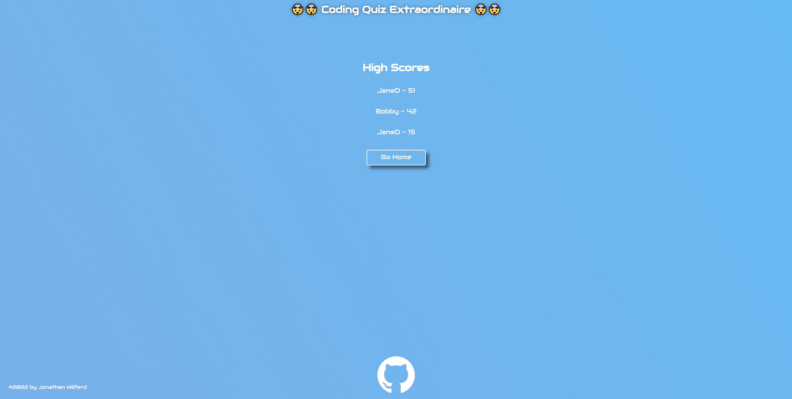
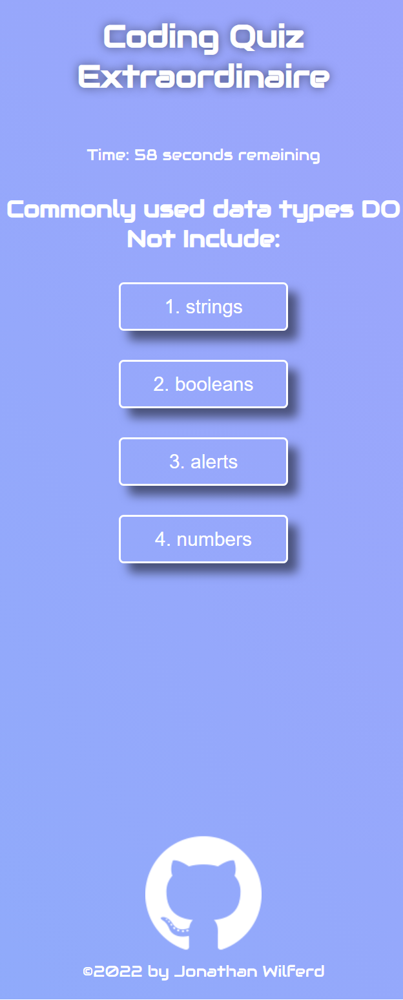

# :pencil2::books::book:The Coding Quiz Extraordinaire:book::books::pencil2:

:computer: **Live Deployment:** https://jwilferd10.github.io/Coding-Quiz-Extraordinaire/

:computer: **Github Repository:** https://github.com/jwilferd10/Coding-Quiz-Extraordinaire

## :open_file_folder: Table of Contents:
  - [Preview](#camera-preview)
  - [Description](#wave-description)
  - [User Story](#book-user-story)
  - [Resources Used](#floppy_disk-resources-used)
  - [Installation](#minidisc-installation-and-usage)
  - [Contact Information](#e-mail-contact-information)

## :camera: Preview:

  
  

## :wave: Description: 

 
The Coding Quiz Extraordinaire is a timed quiz utilizing dynamically generated HTML via JavaScript to alternate through questions and content. Users have sixty seconds on the clock to answer multiple questions, incorrect answers will result in a ten second penalty. If the timer reaches zero the quiz is over otherwise the amount of time left is your final score. Users can then choose to enter their score to a leaderboard and compare how well they did. The final score and entered initials are both saved to localStorage. Enjoy yourselves and happy coding!

  
## :book: User Story:
**AS A person learning JavaScript**
- I WANT to take a timed quiz on JavaScript fundamentals that stores high scores
- SO THAT I can gauge and measure my progress 

**GIVEN I am taking a code quiz**
- WHEN I click the start button
  - THEN a timer starts and I am presented with a question
- WHEN I answer a question
  - THEN I am presented with another question
- WHEN I answer a question incorrectly
  - THEN time is subtracted from the clock
- WHEN all questions are answered or the timer reaches 0
  - THEN the game is over
- WHEN the game is over
  - THEN I can save my initials and score

## :floppy_disk: Resources Used:
Main Resources:
- HTML
- CSS
- JavaScript

## :minidisc: Installation and Usage:
### Install:
- You can do this by clicking the *GREEN* button above and you can download it by ZIP or copy the SSH!
### Usage:
- Click "Start"
- Select answer for each question
- For every CORRECT answer, iterate to next question
- For every INCORRECT answer, iterate to next question with -10 to the time
- Time left is the final score
- Return to main menu or log score
- To log score, enter initials.
- View High Scores showcases a list of the top five scores 

## :e-mail: Contact Information:
- ### [jwilferd10](https://github.com/jwilferd10)
